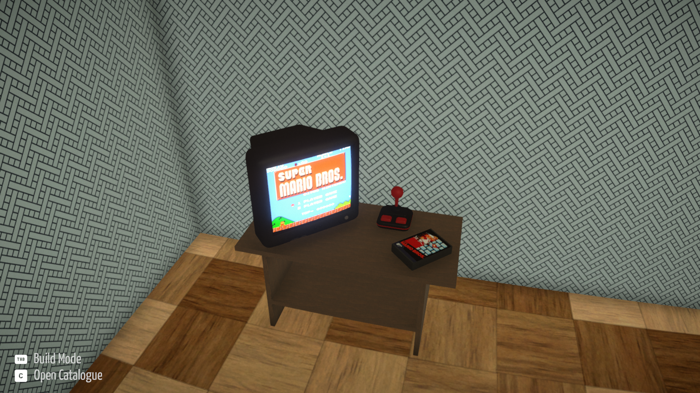

# Boxroom Studio

A companion application for **BOXROOM** that makes adding and editing
custom games easy.

`

------------------------------------------------------------------------

## Features

-   🎮 Create custom games for BOXROOM
-   🖼 Download game information from IGDB
-   📷 Automatically download screenshots
-   🖼 Browse SteamGridDB cover art
-   🚀 Configure custom launch settings *(requires Boxroom-Plus)*
-   📁 Browse for executables, working directories, and cover art
-   ⚙️ First-run setup wizard
-   🔄 Sync custom games back into `owned_games.json` if BOXROOM
    overwrites it
-   🌙 Dark and Light themes

------------------------------------------------------------------------

## Requirements

-   Windows
-   BOXROOM installed
-   IGDB API credentials *(optional but recommended)*
-   SteamGridDB API key *(optional)*

Without API keys you can still create custom games manually.

------------------------------------------------------------------------

## First Launch

On first launch you'll be asked to configure:

-   BOXROOM Cache Folder
-   IGDB Client ID / Secret
-   SteamGridDB API Key
-   Theme

The application also lets you test both API connections.

------------------------------------------------------------------------

## Launch Settings

> **Requires Boxroom-Plus**

The standard version of BOXROOM ignores custom launch settings.

If you want to launch emulators, custom games, or other non-Steam
titles, install **Boxroom-Plus**.

------------------------------------------------------------------------

## Sync Owned_Games.json

BOXROOM may overwrite `owned_games.json`.

If your custom games disappear from your shelf, simply click:

`Sync Owned_Games.json`

This re-adds every custom game ID to `owned_games.json` without
affecting your normal Steam library.

------------------------------------------------------------------------

## Screenshots

Supports downloading screenshots directly from IGDB.

Currently downloads up to **3 screenshots** per game at **720p**.

------------------------------------------------------------------------

## Known Limitations

-   Launch Settings require Boxroom-Plus.
-   IGDB and SteamGridDB require personal API keys.
-   Currently downloads up to 3 screenshots per game.
-   Custom games use AppIDs beginning at `900000000` to avoid conflicts
    with Steam.

------------------------------------------------------------------------

## Credits

-   NestedLoop (BOXROOM)
-   IGDB
-   SteamGridDB

------------------------------------------------------------------------

## License

MIT
